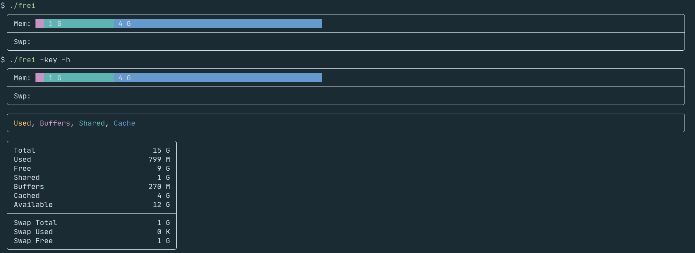

# frei (FREe Improved)



Since almost every basic command nowadays has a fancy Rust or Go rewrite, `free`
should not be an exception.

In case you didn't know, `free` shows your memory usage on Unix-based systems.
`frei` obtains memory data from `/proc/meminfo` and represents it in a colored
bar chart.

## Installation

### Compiling from source

Make sure you have [Go](https://golang.org/doc/install.html) installed.

```sh
git clone https://github.com/alexcoder04/frei
cd frei
go build .
```

## Command-line options

| option     | description                                  |
|------------|----------------------------------------------|
| `--help`   | show list of options                         |
| `-h`       | human-readable numbers (implies ``-numbers`) |
| `-key`     | display color key                            |
| `-numbers` | print numbers in addition to the chart       |
| `-version` | display version and exit                     |

