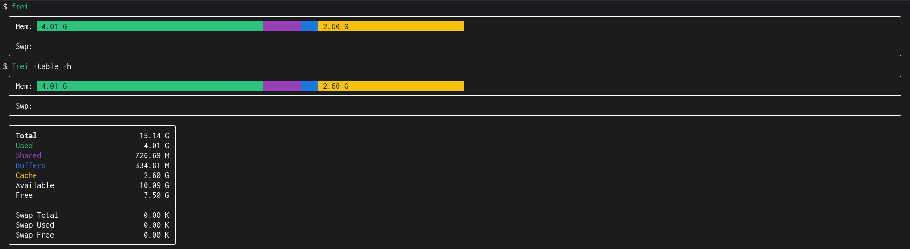

# frei (FREe Improved)



Since almost every basic command nowadays has a fancy Rust or Go rewrite, `free`
should not be an exception.

In case you didn't know, `free` shows your memory usage on Unix-based systems.
`frei` obtains memory data from `/proc/meminfo` and represents it in a colored
bar chart using the same color-coding for as `htop`.

## Installation

### Arch Linux

`frei` is available on the [AUR](https://aur.archlinux.org/packages/frei).

### Pre-compiled binaries

Binaries for `i386`, `amd64` and `arm` are available on the [releases
page](https://github.com/alexcoder04/frei/releases/latest).

### Compiling from source

Make sure you have [Go](https://go.dev/doc/install) installed.

```sh
git clone https://github.com/alexcoder04/frei.git
cd frei

go build .    # builds a binary
go install .  # builds and install a binary to your $GOPATH
```

## Command-line options

| option     | description                                 |
|------------|---------------------------------------------|
| `-help`    | show list of options                        |
| `-h`       | human-readable numbers (implies `-numbers`) |
| `-key`     | display color key                           |
| `-numbers` | print numbers in addition to the chart      |
| `-version` | display version and exit                    |

## Contributing

I appreciate any kind of improvement/feature ideas or bug reports. Don't
hesitate to open an [issue](https://github.com/alexcoder04/frei/issues).

## FAQ

### What is the differerence between "free" and "available" memory?

For more detailed information, see [`free(1)`](https://man.archlinux.org/man/free.1).

"Free" (`MemFree` in `/proc/meminfo`) reports just the amount of memory that is
currently not in use. "Available" (`MemAvailable` in `/proc/meminfo`), on the
other side, is a more sophisticated estimation of how much memory is available
for starting new applications, without swapping. It takes into account the page
size and how much of reclaimable memory can actually be reclaimed.

